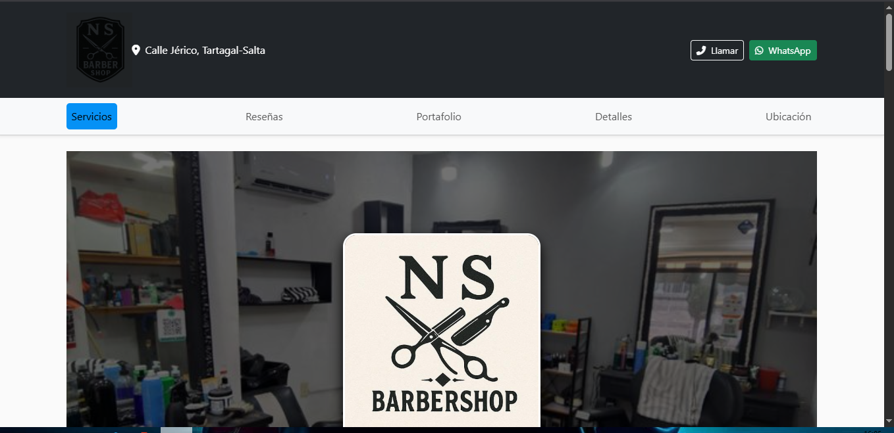
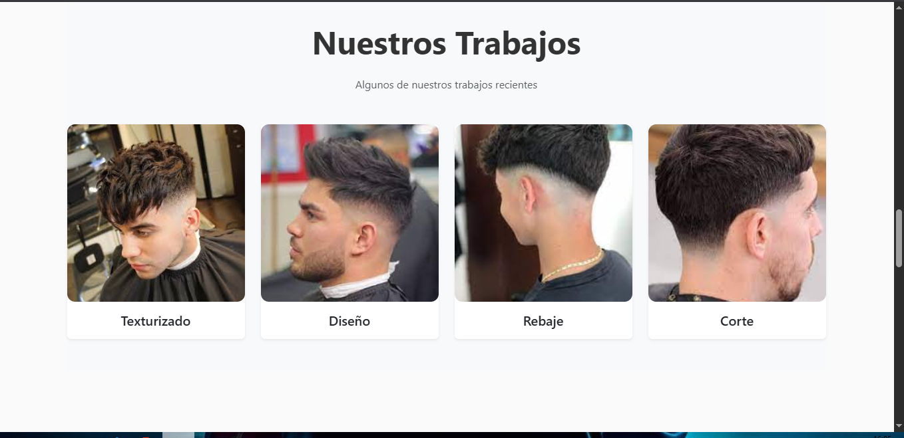
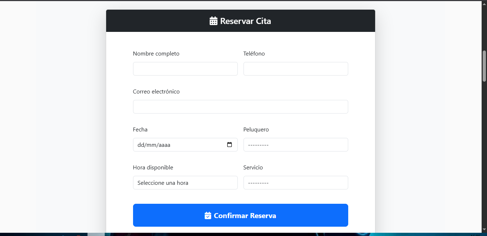

# 💈 Barbería App - Sistema de Turnos  


---

## 📌 Descripción  

Aplicación web desarrollada en **Django** para la gestión de turnos de una barbería.  
El sistema permite a los clientes reservar turnos de manera rápida y sencilla, mientras que el administrador puede gestionarlos desde un **panel moderno y personalizable (Jazmin Admin)**.  

---

## 🚀 Tecnologías utilizadas  

- **Backend:** Django 4.2 (Python)  
- **Base de datos:** MySQL  
- **Frontend:** HTML5, CSS3, JavaScript, Bootstrap  
- **Admin personalizado:** Jazmin (tema moderno para Django Admin)  

---

## ⚙️ Funcionalidades  

✅ Registro de turnos con fecha y hora  
✅ Validación de disponibilidad de horarios  
✅ Panel de administración moderno para gestionar clientes y turnos  
✅ Diseño responsivo con Bootstrap  
✅ CRUD completo (crear, leer, actualizar y eliminar turnos)  
✅ Integración con base de datos MySQL  

---

## 🛠️ Instalación y configuración  

1. Clonar el repositorio:  
   ```bash
   git clone https://github.com/solanomillo/Barberia.git
   cd barberia-turnos
    ```
2. Crear y activar entorno virtual:
    ```bash
    python -m venv venv
    source venv/bin/activate  # Linux/Mac
    venv\Scripts\activate     # Windows
    ```
3. Instalar dependencias:
   ```bash
    pip install -r requirements.txt
   ```
4. Configurar la base de datos MySQL en settings.py:
    ```bash
        DATABASES = {
            'default': {
                'ENGINE': 'django.db.backends.mysql',
                'NAME': 'barberia_db',
                'USER': 'tu_usuario',
                'PASSWORD': 'tu_password',
                'HOST': 'localhost',
                'PORT': '3306',
            }
        }
    ```
5. Migrar la base de datos:
    ```bash
    python manage.py migrate
    ````
6. Crear superusuario:
    ```bash
    python manage.py createsuperuser
    ```
7. Ejecutar el servidor:
    ```bash
    python manage.py runserver
    ```
# 📂 Estructura recomendada del proyecto
   
        barberia/
    ├── barberia/              # Proyecto Django
    ├── citas/                # App principal-Archivos estáticos (CSS, JS, imágenes)
    ├── empleados/             
    ├── servicios/                
    ├── requirements.txt       # Dependencias
    ├── manage.py
    ├── README.md
    └── screenshots/           # Capturas de pantalla


## 🖼️ Capturas de pantalla




    
# 👨‍💻 Autor
**Julio Solano**  
🔗 [GitHub](https://github.com/solanomillo)  
📧 solanomillo144@gmail.com

# 📄 Licencia
Este proyecto está bajo la licencia MIT.
Podés usarlo, compartirlo y modificarlo libremente.
